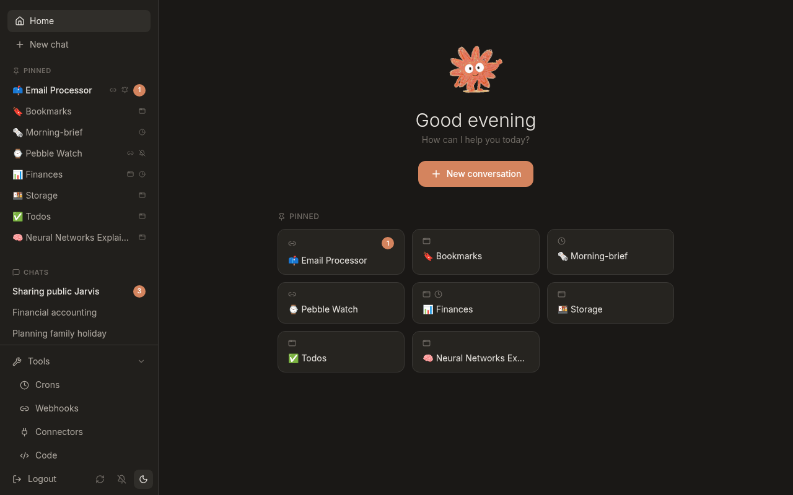
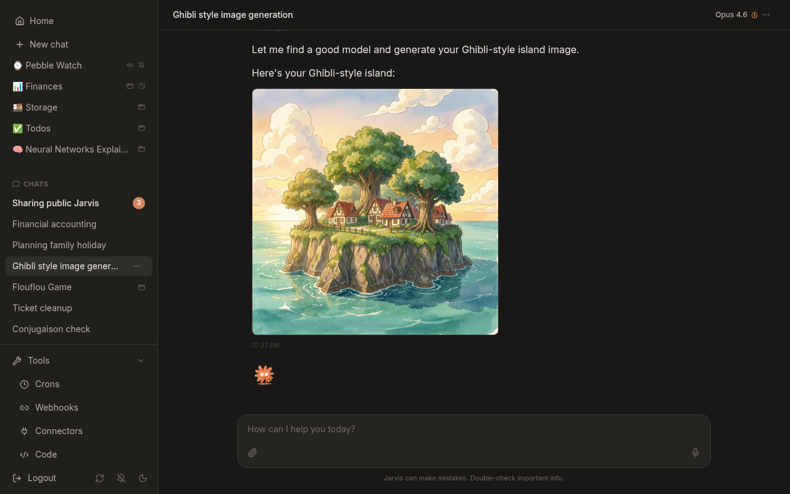
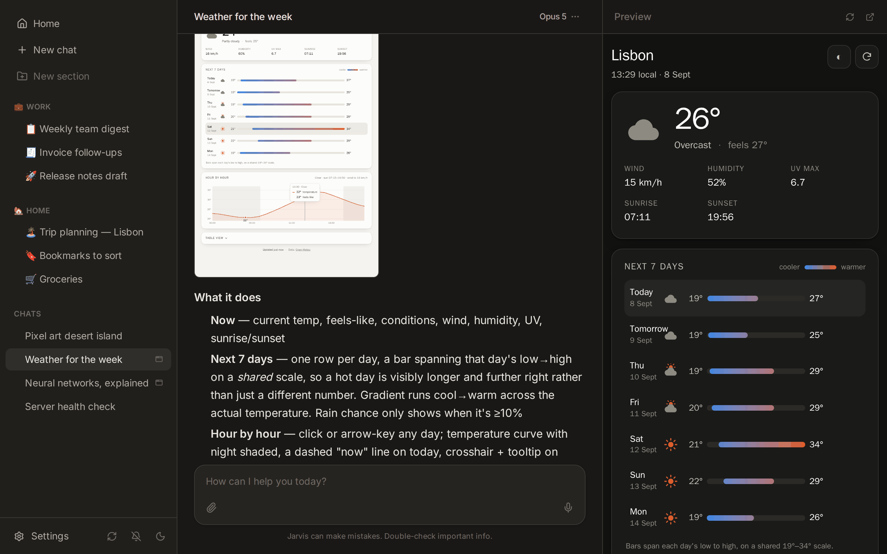
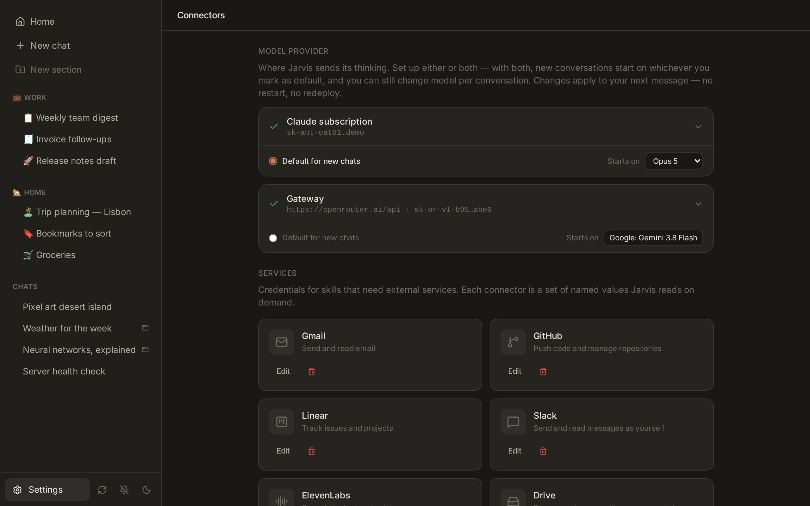
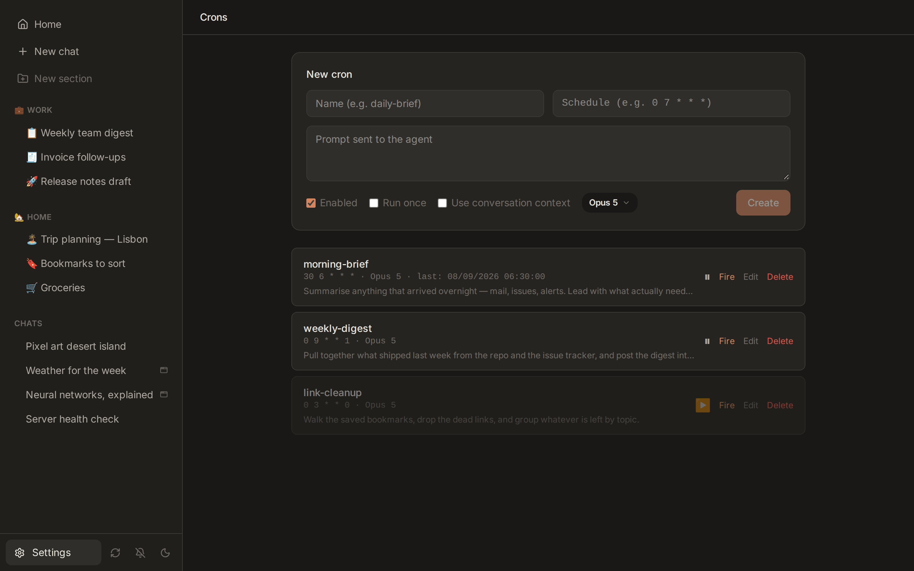
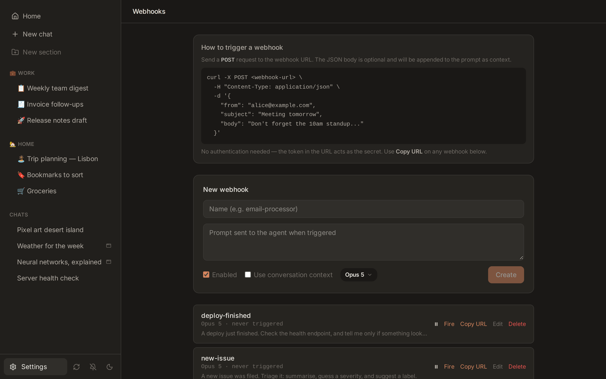
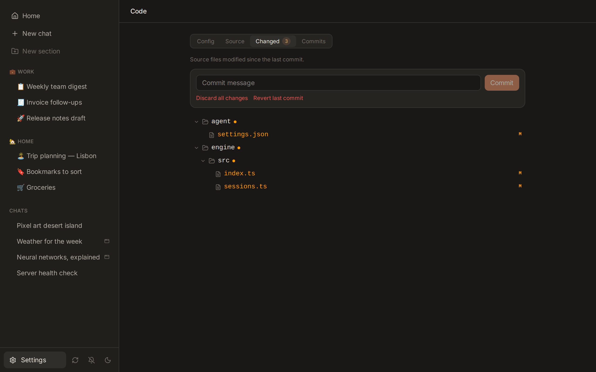

<p align="center">
  
</p>

<h1 align="center">Jarvis</h1>

<p align="center">A self-hosted AI assistant that can modify its own code.</p>

<p align="center">
  
</p>

<p align="center">
  
</p>

Jarvis is a web-based chat interface backed by the [Claude Code CLI](https://docs.anthropic.com/en/docs/claude-code). What makes it different from other AI chat wrappers: the assistant has full read/write access to its own source code. Ask it to add a feature, fix a bug, or build a new integration -- it edits the frontend and backend directly, and you can review, commit, or revert every change through git.

The idea is less "deploy and use" and more "deploy and shape." You start with a general-purpose assistant and vibe-code it into something personal.

## Features

- **Self-coding** -- Claude can edit Jarvis's own frontend and backend through chat. Every change goes through git: diffable, committable, revertable.
- **Apps** -- Claude creates interactive HTML/CSS/JS apps displayed in a split pane alongside chat. Useful for dashboards, tools, visualizations, games.
- **Connectors** -- Plug in Gmail, GitHub, Slack, Linear, and others from the UI. Or create custom connectors with just a name and env var fields -- no code, no restart.
- **Cron jobs** -- Scheduled prompts with full conversation context. "Summarize my inbox every morning at 7am" -- the agent writes the cron itself.
- **Webhooks** -- HTTP endpoints that trigger the agent with arbitrary payloads. Works well with n8n, Home Assistant, iOS Shortcuts, etc.
- **Voice input** -- Audio transcribed via Whisper and injected into the conversation.
- **Skills** -- Modular instruction sets (Markdown files) that auto-activate based on context. The agent can create new skills for itself.
- **Plugins** -- Add Claude Code plugin marketplaces from Settings, install plugins, toggle them on or off. Enabled plugins load in every conversation, cron and webhook.
- **Mobile PWA** -- Installable, responsive, with push notifications and share target support.

### Apps

Ask Jarvis to build you a tool, game, or visualization -- it writes the HTML/CSS/JS and renders it in a split pane next to the chat.

<p align="center">
  
</p>

### Connectors

Plug in third-party services from the UI. Built-in connectors for Gmail, GitHub, Slack, Linear, and ElevenLabs. Create custom connectors with just a name and env var fields -- no code, no restart.

<p align="center">
  
</p>

### Cron jobs & Webhooks

Schedule prompts on any cron expression. Expose HTTP endpoints that trigger the agent with arbitrary payloads -- works well with n8n, Home Assistant, iOS Shortcuts.

<p align="center">
  
  
</p>

### Git integration

Browse the codebase, review diffs, and commit -- all from the web UI. Every change Claude makes is a file change you can diff, commit, or throw away.

<p align="center">
  
</p>

## Guardrails

Giving an AI write access to its own code sounds reckless. Here is what makes it workable:

- **Full git integration** -- The repo is the safety net. Every modification Claude makes is a file change you can diff, commit, or throw away. The web UI exposes git status, diff, log, commit, discard, and revert.

The recovery strategy: try discarding uncommitted changes first. If the repo is clean but still broken, revert the last commit.

## Quick Start

Requires Docker and Docker Compose.

```bash
git clone <repo-url> jarvis
cd jarvis
cp .env.example .env
```

Edit `.env` and set the three required variables:

| Variable | How to get it |
|----------|---------------|
| `JWT_SECRET` | `openssl rand -hex 32` |
| `CLAUDE_CODE_OAUTH_TOKEN` | Run `claude setup-token`, paste the `sk-ant-oat01-...` token it prints (not the one in `~/.claude/.credentials.json` -- that one expires within hours) |
| `INTERNAL_SECRET` | Leave blank -- auto-generated on first boot |

```bash
docker compose up -d
```

Open `http://localhost:5173`. First visit prompts you to create an admin account.

## Architecture

```
jarvis/
├── backend/          Fastify API + WebSocket streaming + cron scheduler
├── frontend/         React SPA (chat, settings, connectors, app preview)
├── engine/           Owns the Claude CLI subprocess lifecycle
├── agent/            Claude config: system prompt, skills, rules
├── workspace/        Claude's scratch space: memory, uploads, apps
└── docker-compose.yml
```

| Service | Port | Description |
|---------|------|-------------|
| frontend | 5173 | Web UI |
| backend | 3005 | REST API + WebSocket |
| engine | -- | Internal: owns Claude CLI process |
| whisper | -- | Internal: speech-to-text |
| playwright | -- | Internal: browser automation via MCP |

- **Backend**: Fastify 5, better-sqlite3 (WAL mode), TypeScript
- **Frontend**: React 19, Vite, Tailwind CSS 4, TypeScript
- **AI engine**: Claude Code CLI spawned as a subprocess per conversation, streaming JSON events over WebSocket
- **Infrastructure**: Docker Compose, Node 25

## Make It Yours

The point of Jarvis is that it adapts to you. A few ways in:

**Add connectors from the UI.** Go to Settings, then Connectors. Built-in options include Gmail, GitHub, Slack, Linear, and others. Credentials are stored in SQLite and injected into the Claude process at runtime -- no `.env` changes, no restarts.

**Create custom connectors.** Give it a name and a set of environment variable fields. That is it -- no code required. The values are available to Claude immediately.

**Install plugins.** Go to Settings, then Plugins. Add a marketplace by `owner/repo`, a git URL, or a local path (`anthropics/claude-code` is the official one), then install what you want from its catalogue. Plugins go in at user scope, so an enabled one is available to every conversation, cron and webhook -- warm chats pick it up on their next message. Plugins that gate themselves behind an opt-in flag file get a third state, **Always on**, which sets that flag so the plugin injects itself into every session instead of waiting to be called. Under the hood this drives `claude plugin` in the engine container, so `agent/settings.json` stays exactly as the CLI expects it.

**Write skills.** Skills are Markdown files in `agent/skills/<name>/SKILL.md`. Each one describes a capability -- when to use it, what tools to call, what APIs to hit. Claude reads the relevant skill automatically based on conversation context. You can also ask Claude to write skills for itself: "create a skill that queries my Notion database."

**Self-edit through chat.** This is the big one. Ask Jarvis to change its own interface, add a new API endpoint, or build a feature you want. It modifies the source directly, and hot reload picks up the changes. If something breaks, git discard/revert (in the web UI) is there to roll it back.

## Stack

TypeScript throughout. Node 25, Fastify 5, React 19, better-sqlite3, Vite, Tailwind CSS 4, Docker Compose. The AI engine is the [Claude Code CLI](https://docs.anthropic.com/en/docs/claude-code) running as a subprocess.

## License

MIT
