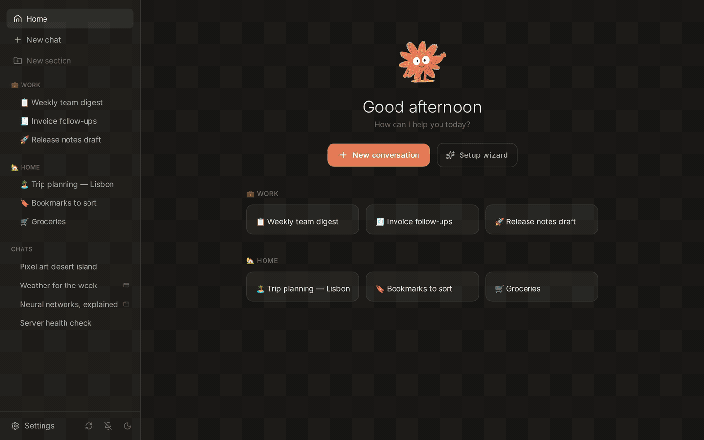
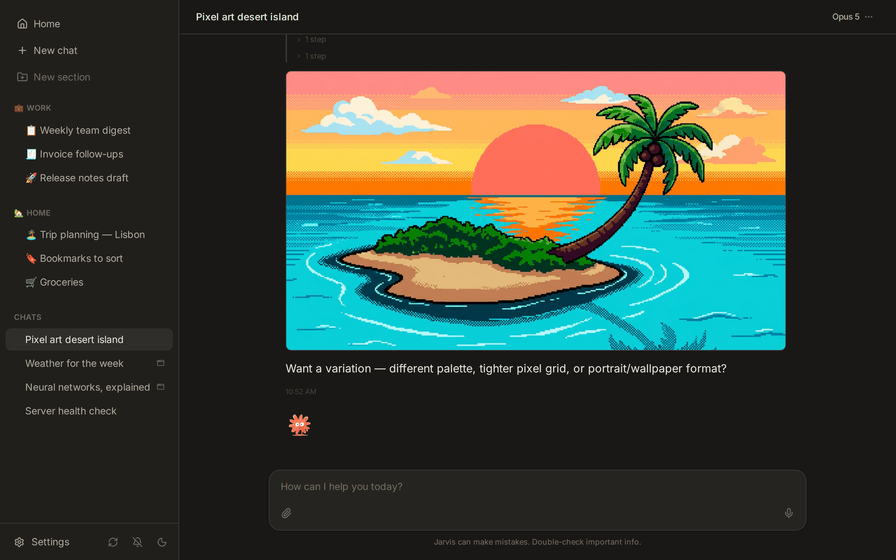
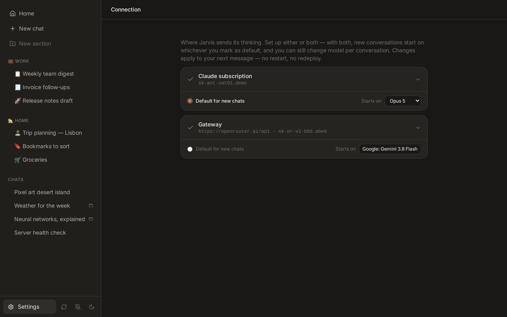

<p align="center">
  
</p>

<h1 align="center">Jarvis</h1>

<p align="center"><strong>A self-hosted AI assistant that can rewrite its own code.</strong></p>

<p align="center">
  
  
  
  
</p>

<p align="center">
  <picture>
    <source media="(prefers-color-scheme: light)" srcset="docs/demo-light.gif">
    
  </picture>
</p>

Jarvis is a web chat interface backed by the [Claude Code CLI](https://docs.anthropic.com/en/docs/claude-code). What separates it from other chat wrappers: **the assistant has full read/write access to its own source code.** Ask it to add a feature, fix a bug, or build an integration — it edits the frontend and backend directly, and you review, commit, or revert every change through git.

The idea is less "deploy and use" and more "deploy and shape." You start with a general-purpose assistant and vibe-code it into something personal.

## Why it's different

- **It edits itself.** Not a plugin API, not a config file — the agent opens your actual source, changes it, and the container rebuilds. Git is the safety net.
- **It runs without you.** Crons and webhooks fire the agent on a schedule or an HTTP call, with full conversation context. Your assistant keeps working while you sleep.
- **It reaches your things.** Connectors put real credentials — Gmail, GitHub, Slack, Linear, whatever you add — in the agent's hands at runtime, no code and no restart.

## Features

| | |
|---|---|
| **Self-coding** | Claude edits Jarvis's own frontend and backend through chat. Every change is diffable, committable, revertable. |
| **Apps** | Interactive HTML/CSS/JS apps rendered in a split pane beside the chat — dashboards, tools, visualizations, games. |
| **Connectors** | Gmail, GitHub, Slack, Linear and more from the UI. Or a custom connector with just a name and env var fields. |
| **Cron jobs** | Scheduled prompts with full conversation context. "Summarize my inbox at 7am" — the agent writes the cron itself. |
| **Webhooks** | HTTP endpoints that trigger the agent with arbitrary payloads. Pairs well with n8n, Home Assistant, iOS Shortcuts. |
| **Skills** | Markdown instruction sets that auto-activate on context. The agent can write new skills for itself. |
| **Browser** | A real Chromium the agent drives through Playwright, for sites that need clicking rather than fetching. |
| **Voice input** | Audio transcribed by a bundled Whisper and injected into the conversation. |
| **Sharing** | Send someone a link to a conversation, read-only or with replies. No account needed on their side. |
| **API keys** | One header, and a script talks to the same API the web UI does — list chats, send a message, read the stream. |
| **Any model** | Claude by default, or any OpenRouter model that can run the agent. Both providers live at once. |
| **Mobile PWA** | Installable and responsive, with push notifications and share-target support. |

## A closer look

### Apps

Ask Jarvis to build a tool, game, or visualization — it writes the HTML/CSS/JS and renders it in a split pane next to the chat.

<p align="center">
  <picture>
    <source media="(prefers-color-scheme: light)" srcset="docs/screenshot-app-light.png">
    
  </picture>
</p>

### Git integration

Browse the codebase, review diffs, and commit — all from the web UI. Every change Claude makes is a file change you can diff, commit, or throw away.

<p align="center">
  <picture>
    <source media="(prefers-color-scheme: light)" srcset="docs/screenshot-git-light.png">
    
  </picture>
</p>

### Connectors

Plug in third-party services from the UI. Built-in connectors for Gmail, GitHub, Slack, Linear, and ElevenLabs. Create custom ones with just a name and a set of env var fields — no code, no restart.

<p align="center">
  <picture>
    <source media="(prefers-color-scheme: light)" srcset="docs/screenshot-connectors-light.png">
    
  </picture>
</p>

### Cron jobs & webhooks

Schedule prompts on any cron expression. Expose HTTP endpoints that trigger the agent with arbitrary payloads.

<p align="center">
  <picture>
    <source media="(prefers-color-scheme: light)" srcset="docs/screenshot-crons-light.png">
    
  </picture>
  <picture>
    <source media="(prefers-color-scheme: light)" srcset="docs/screenshot-webhooks-light.png">
    
  </picture>
</p>

### Browser

Some things can't be fetched, they have to be clicked — a site behind a login, a flow with no API. Jarvis ships a headless Chromium the agent drives over the Playwright MCP server, available to every conversation with no setup.

Headless has a limit: it can't solve a captcha or take a login you'd rather type yourself. For that there is an optional headful browser you can watch and take over, handing control back when you're done.

### Images and video

Ask for a picture and you get one: the `media` skill calls the gateway's image
endpoint and drops the result into the conversation. Video works the same way.
Both need an OpenRouter key in Settings → Connection — the chat model itself
cannot draw.

<p align="center">
  <picture>
    <source media="(prefers-color-scheme: light)" srcset="docs/screenshot-image-light.png">
    
  </picture>
</p>

### Sharing

Share a conversation with a link. Read-only shows the transcript as it continues; "can reply" lets the other person answer too. They get a stripped view — the conversation, and the app if there is one — with no access to the rest of your instance, and no account needed. Links can be revoked or regenerated at any time.

Generated apps have their own links, separate from conversation shares and separately revocable.

### API keys

Settings → API keys mints long-lived keys for the HTTP API. There is no separate
integration API to learn: a key authenticates the same endpoints the web
interface calls, so anything you can do in the UI, a script can do with one
header.

```bash
curl https://your-jarvis/api/conversations \
  -H "Authorization: Bearer jarvis_sk_..."

curl -X POST https://your-jarvis/api/conversations/<id>/messages \
  -H "Authorization: Bearer jarvis_sk_..." \
  -H "Content-Type: application/json" \
  -d '{"content": "What is on my calendar today?"}'
```

A key carries full account access and never expires — it is stored only as a
hash and shown once, at creation. It cannot mint or revoke keys, so a leaked one
can be cut off from the UI without it minting a replacement first.

## Quick Start

Requires Docker and Docker Compose (v2.24+).

```bash
git clone https://github.com/julienR2/jarvis.git
cd jarvis
docker compose up -d
```

Open `http://localhost:5173`. The first visit walks you through the rest: create your account, then paste a Claude OAuth token (the wizard shows how to get one with `claude setup-token` — requires a Claude subscription). Secrets are auto-generated on first boot; there is nothing to configure by hand.

Creating that first account asks for a **setup code**, printed in the backend logs:

```bash
docker compose logs backend | grep setup
```

It's there so an instance reachable from the internet before you've finished setting it up can't be claimed by someone else. Set `SETUP_CODE` in `.env` to pin your own instead.

Your Claude credentials aren't frozen at setup: Settings → Connection changes them at any time, and can point Jarvis at OpenRouter or any Anthropic-compatible gateway instead. Both are verified before they're saved, and take effect on your next message without a restart. If you go the gateway route, read [Models and providers](#models-and-providers) first — not every model can run the agent.

No `.env` file is needed. To pre-seed values instead — a headless install, or handing off a pre-configured instance — copy `.env.example` to `.env` and fill in what you want (OAuth token, admin credentials, timezone).

## Guardrails

Giving an AI write access to its own code sounds reckless. Here is what makes it workable:

- **Git is the undo button.** Every modification is a file change you can diff, commit, or throw away. Settings → Code → Changed has commit, discard-all, and revert-last-commit, so recovery never depends on the chat that broke things still working.
- **The agent can't reach your login.** The Claude subprocess runs with the JWT signing key and admin credentials stripped from its environment.
- **Credentials live outside the code.** Connector secrets are in the database and read at runtime, so nothing the agent commits can leak them into git history.
- **Nothing is exposed by accident.** Published ports bind to localhost; everything else talks over the Docker network. What reaches the internet is whatever you deliberately put a reverse proxy in front of.

The recovery strategy: discard uncommitted changes first. If the tree is clean but still broken, revert the last commit. If the UI won't load at all, both are one `git` command away on the host — the repo is a normal checkout.

## Security

Worth being plain about, because Jarvis is unusual: it is an agent with a shell, write access to its own source, and your credentials.

- **Single-user by design.** Every account on an instance is a full admin — all conversations, all connector secrets, git write access. There is no permission model. Don't hand out accounts; hand out share links.
- **The agent runs unattended.** It executes commands without prompting for approval, because a cron firing at 7am has nobody to ask. Whatever the agent can reach, a sufficiently convincing web page or email it reads can also reach. Give it credentials scoped to what it actually needs.
- **First run is claimed with a code.** Creating the first account requires a setup code printed in the backend logs, so an instance that is reachable before you have configured it can't be taken over by whoever finds it.
- **API keys are hashed and can't escalate.** Keys are stored as SHA-256, shown once, and refused on the key-management endpoints — revoking a leaked key is final.
- **Secrets are generated, never defaulted.** JWT and internal secrets are random on first boot and stored outside git. There are no default credentials, and placeholder values are actively rejected.

Found a vulnerability? See [SECURITY.md](SECURITY.md).

## Models and providers

Settings → Connection holds both providers. Either can be the default for new
chats, each carries its own starting model, and a key is verified with a real
test message before it is saved.

<p align="center">
  <picture>
    <source media="(prefers-color-scheme: light)" srcset="docs/screenshot-connection-light.png">
    
  </picture>
</p>

Both providers are configured at once, and the **shape of the model id decides where a message goes**: a namespaced id (`openai/gpt-5.6`) goes to the gateway, a bare one (`claude-opus-5`) to Anthropic. That is per-conversation, so a chat on GPT and a chat on Claude can run side by side. The engine and the model picker apply the same rule, so they cannot disagree.

If you point Jarvis at OpenRouter, the model list is filtered, and **the interesting-looking model you wanted may not be there**. To run the agent, a text model must:

- **support tool calling** — every turn may reach for Bash, Read or Edit, so a model without tools cannot complete a single turn;
- **accept `max_tokens`** — the Messages API requires it;
- **have a context window of at least 32k** — the smallest real Jarvis turn measured here is around 36k once the system prompt and skills are counted, so a 4k or 8k window cannot hold one.

Image and video models are exempt from all three. They are never asked to run the agent — they are called directly at `/v1/images` or `/v1/videos` with your message as the prompt — so filtering them on tool support would hide every image model there is.

**Audio generation is not wired up yet.** Audio models are listed and selectable, but picking one and asking for a sound fails with "audio generation isn't supported yet" — the generation path handles image and video only. Listed because the catalogue reports them honestly; unimplemented because the endpoint shape hasn't been confirmed.

Two further caveats worth setting expectations on:

- OpenRouter's own Claude Code guide warns that it "may not work correctly with other providers". Jarvis does not change that. Non-Anthropic models work, but treat tool-heavy and subagent-heavy work as the part to check first on a model you have not tried.
- **Switching provider mid-conversation loses the CLI's context carry-over.** Jarvis keeps its own transcript, so nothing disappears from the screen, but the underlying CLI starts fresh — a transcript belongs to the provider that produced it.

## Deploying it somewhere

Jarvis edits its own source at runtime, so its code is a **bind-mounted git checkout, not a baked image**. That is the feature, not an oversight: an immutable image can't rewrite itself. Deploying Jarvis means putting the repo on a host and running compose against it.

On a managed Docker platform (Coolify, Dokploy, Portainer), use the **Docker Compose** deployment type pointed at your fork — it clones the repo to the host, which is exactly the layout Jarvis needs. Two settings matter:

- **`BIND_ADDR`** — ports bind to `127.0.0.1` by default. If your platform routes to the container over the Docker network, leave it. If it routes to a host port, set `BIND_ADDR=0.0.0.0` and make sure the proxy in front terminates TLS.
- **`SETUP_CODE`** — set it explicitly. On a platform where reading container logs is awkward, pinning the code beats hunting for it, and the instance may be internet-reachable the moment it boots.

Everything else is optional. Secrets generate themselves on first boot, and all state lives in `agent/` — back up that one directory and you have the instance.

Upgrades are `git pull` plus `docker compose up -d`. Database migrations run automatically at startup. Because the agent may have committed its own changes, expect to merge rather than fast-forward: your instance's history is genuinely its own.

## Architecture

```
jarvis/
├── backend/          Fastify API + SSE streaming + cron scheduler
├── frontend/         React SPA (chat, settings, connectors, app preview)
├── engine/           Owns the Claude CLI subprocess lifecycle
├── agent/            Claude config: system prompt, skills, rules
├── workspace/        Claude's scratch space: memory, uploads, apps
└── docker-compose.yml
```

| Service | Port | Description |
|---------|------|-------------|
| frontend | 5173 | Web UI |
| backend | 3005 | REST API + SSE streaming |
| engine | — | Internal: owns Claude CLI process |
| whisper | — | Internal: speech-to-text |
| playwright | — | Internal: Chromium the agent drives via MCP |

- **Backend**: Fastify 5, better-sqlite3 (WAL mode), TypeScript
- **Frontend**: React 19, Vite, Tailwind CSS 4, TypeScript
- **AI engine**: Claude Code CLI spawned as a subprocess per conversation, streaming JSON events to the browser over SSE
- **Infrastructure**: Docker Compose, Node 25

## Make It Yours

The point of Jarvis is that it adapts to you. A few ways in:

**Add connectors from the UI.** Settings → Connectors. Built-in options include Gmail, GitHub, Slack, Linear, and others. Credentials are stored in SQLite and injected into the Claude process at runtime — no `.env` changes, no restarts.

**Create custom connectors.** Give it a name and a set of environment variable fields. That is it — no code required. The values are available to Claude immediately.

**Write skills.** Skills are Markdown files in `agent/skills/<name>/SKILL.md`. Each describes a capability — when to use it, what tools to call, what APIs to hit. Claude reads the relevant skill automatically based on conversation context. You can also ask Claude to write skills for itself: "create a skill that queries my Notion database."

**Self-edit through chat.** This is the big one. Ask Jarvis to change its own interface, add an API endpoint, or build a feature you want. It modifies the source directly and the container rebuilds; a banner appears when the new build is ready, and reloading picks it up. If something breaks, Settings → Code → Changed has discard and revert.

## Stack

TypeScript throughout. Node 25, Fastify 5, React 19, better-sqlite3, Vite, Tailwind CSS 4, Docker Compose. The AI engine is the [Claude Code CLI](https://docs.anthropic.com/en/docs/claude-code) running as a subprocess.

## License

MIT
